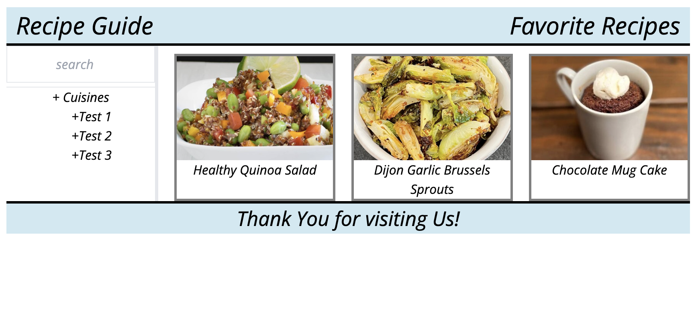

# recipe-guide

## Description

Recipe guide is an application where you can search and try new recipies daily. In addition to recipes from various cuisines, you will also find easy and healthy recipes.

First view of the app.

## Features 

In the left side of the application you will find the search button in the navigation bar where you can search for the recipes. Below there are filter for you to choose which cuisine would you like you try today. 

In the main are you will see recipe cards some of the easy to make ones. 

In the right side of the header you will see your favorite recipes from our site. 

When you click on the recipe it will open up another window with the recipe name, ingredient list and step by step instuctions. 

While creating this application, we paid attention to all its contents and components. 

We used [TailwindCSS](https://tailwindcss.com/) for CSS. 

For API KEY we used [spoonacular API](https://spoonacular.com/food-api/).

## Summary

