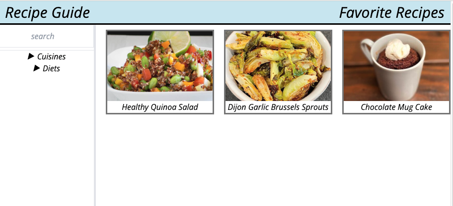

# The Recipe Guide 
Recipes for every taste! 

## Description

Recipe guide is an application where you can search and try new recipies daily. In addition to recipes from various cuisines, you will also find easy and healthy recipes. 

USER STORY: 

As someone that wants to try and learn recipes
I WANT to be able to search new recipes by type and cuisine and store them
SO I can have access to my favorite recipes.

First view of the app.

## Features 

In the left side of the application you will find the search button in the navigation bar where you can search for the recipes. Below there are filters for you to choose which cuisine would you like you try, as well as the diet types you may prefer.

In the main part of the page you will see the recipe cards there are displayed some of the easy to make ones. 

In the right side of the header you will see your favorite recipes from our site. You can create your own list of your favorite recipes so you can access them easily trough the favorites.

When you click on the recipe it will open up another window with the recipe name, ingredient list and step by step instuctions. 

While creating this application, we paid attention to all its contents and components. 

We used the [TailwindCSS](https://tailwindcss.com/) API for CSS. (Instead of Bootstrap)

For the Recipe Guide we used the [spoonacular API](https://spoonacular.com/food-api/) food API.

The page contains the following file structure: 
Main Page 
HTML - index.html 
Assets - CSS - style.css
       - JavaScript - script.js
Images folder
Readme.md

Recipe Page
HTML - recipe-page.html
Assets - CSS - recipe-pg.css
       - JavaScript - script.js 

## Summary

While developing this page, we aimed to make it useful down to the smallest detail. 
Our Motto was also simple and useful recipes for every taste.
The Recipe Guide runs functionally with the given directions by the user. Hope you use and enjoy our app as we do while creating it. Enjoy your recipes / meals. Bon Apetit! 

## Deployment Link

https://davisnate04.github.io/recipe-guide/ 

## Authors

Dilek Nuredin - [GitHub] (https://github.com/dileknrdn)

Jaylen Williams - [GitHub] (https://github.com/jmw2227)

Nathaniel Davis - [GitHub] (https://github.com/davisnate04)

